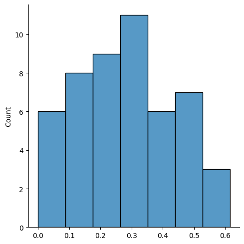

# 🏋️‍♂️ Gym Chaos Simulator


> A probabilistic simulator demonstrating how a small “noisy” minority can drive overall disorder in a gym setting — an application of the Pareto principle in social behavior.
---

## 📝 Overview

**Gym Chaos Simulator** models a weight area with paired dumbbell racks and two types of users:

- **Tidy Users** (majority): return weights correctly when possible.  
- **Messy Users** (minority): always return weights to random spots.  

By running multiple daily cycles, the simulator measures the **chaos ratio** — the fraction of dumbbells not in their original positions—over time. Results are plotted as a distribution of chaos levels using Seaborn.

This illustrates the Pareto-inspired concept:  
> _“The greatest societal shifts are often driven by a vocal minority, not the silent majority.”_  

In this context, even one messy user among many tidy users can substantially increase overall disorder.

---

## ⚙️ Architecture & Components

1. **`Gym` class**  
   - Initializes 14 even-weight dumbbells (10 kg to 36kg).  
   - Tracks a mapping of rack positions → dumbbels.  
   - Methods:  
     - `restart_the_day()`: resets all weights to original positions.  
     - `list_dumbbells()`: returns dumbbels currently in use.  
     - `list_available_spaces()`: returns empty rack positions.  
     - `pick_up_dumbbell(weight)`: marks a rack slot as empty.  
     - `return_dumbbell(pos, weight)`: places a dumbbel into a specified slot.  
     - `calculate_chaos()`: computes fraction of mis‐placed dumbbels.

2. **`User` class**  
   - **Parameters**: `user_type` (1 = tidy, 2 = messy) and a reference to the `Gym`.  
   - Actions per user:  
     - `start_training()`: randomly selects and removes a dumbbell.  
     - `finish_training()`: returns the dumbbell—tidy users attempt the original slot, messy users choose randomly.

3. **Simulation Loop**  
   - Creates 10 tidy users + 1 messy user.  
   - For 50 simulated days:  
     1. Reset gym.  
     2. Each user takes and returns weights in randomized order over 10 sessions.  
     3. Record daily chaos ratio.  
   - Visualize distribution of chaos ratios with `sns.displot`.

---

## 🚀 Installation & Setup

1. **Clone the repository**  
   ```bash
   git clone https://github.com/marcosnunes0/gym-chaos-simulator.git
   cd gym-chaos-simulator
   ```

2. **Create & activate virtual environment**
   ```bash
   python3 -m venv venv
   venv\Scripts\activate # Windows
   source venv/bin/activate #Linux/macOS 
   ```

3. **Install dependencies**
   ```bash
   pip install -r requirements.txt
   ```

# ▶️ Usage

   ```bash
   python gym.py
   ```

- The script will run the simulation and display a Seaborn distribution plot of chaos ratios.
- Close the plot window to end the program.

# 📊 Interpreting Results



The histogram above shows one example of the final chaos‐ratio distribution over 50 simulated days:

- X‑axis (Chaos Ratio): fraction of dumbbells misplaced (0 = perfect order, 1 = complete disorder).

- Y‑axis (Count): number of days that resulted in each chaos level.

**Key Insights:**

- Even with 10 tidy users and just 1 messy user, the distribution is shifted toward higher chaos ratios (peaks around 0.3–0.5).

- This confirms the Pareto‑inspired idea that a small noisy minority can drive significant disorder.

- The spread of values highlights daily variability, but the persistent right‑shift underscores the disproportionate impact of the messy user.

# 🔍 Pareto Principle & “Noisy Minority”

This simulator embodies the idea that minorities (here, messy users) can disproportionately impact aggregate behavior. Even a single non‐conformist among many conformists generates measurable disorder — echoing the Pareto‐inspired insight that “large transformations are often driven by a vocal few.”

# 📄 License

This project is licensed under the MIT License. See [LICENSE](https://github.com/marcosnunes0/gym-chaos-simulator/blob/main/LICENSE) for details.